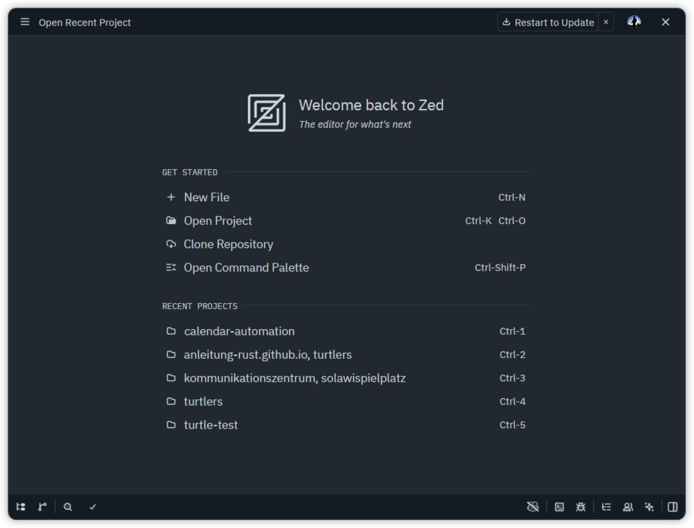

# Einrichtung der Programmierumgebung

Bevor wir mit dem Programmieren beginnen können, müssen wir ein paar Programme auf deinem Computer installieren. Keine Sorge – wir gehen das Schritt für Schritt durch!

## Was brauchen wir?

1. **Rust** – Die Programmiersprache, die wir verwenden
2. **Zed** – Der empfohlene Editor, in dem wir unseren Code schreiben
3. **Rust-Unterstützung in Zed** – Sprach- und Code-Hilfe für Rust

## Schritt 1: Rust installieren

Rust ist die Programmiersprache, mit der wir arbeiten werden. Zusammen mit Rust wird auch **Cargo** installiert – ein Werkzeug, das uns bei der Verwaltung unserer Programme hilft.

### Installation auf Windows

1. Gehe zu [https://rustup.rs/](https://rustup.rs/)
2. Lade die Installationsdatei herunter
3. Führe die Datei aus und folge den Anweisungen
4. Wenn du gefragt wirst, wähle die Standardinstallation (Option 1)

### Installation auf macOS oder Linux

1. Öffne das Terminal
2. Kopiere diesen Befehl und drücke Enter:
   ```bash
   curl --proto '=https' --tlsv1.2 -sSf https://sh.rustup.rs | sh
   ```
3. Folge den Anweisungen auf dem Bildschirm
4. Wähle die Standardinstallation (Option 1)

### Installation überprüfen

Um zu prüfen, ob die Installation geklappt hat:

1. Öffne ein neues Terminal oder eine neue Eingabeaufforderung
2. Tippe `cargo --version` und drücke Enter
3. Du solltest eine Versionsnummer sehen, z.B. `cargo 1.92.0`

## Schritt 2: Zed installieren

Zed ist der empfohlene Editor für diese Anleitung. Er ist schnell, modern und gut für Rust geeignet.

1. Gehe zu [https://zed.dev/](https://zed.dev/)
2. Lade Zed für dein Betriebssystem herunter
3. Installiere das Programm
4. Starte Zed

### Rust-Unterstützung in Zed

In den meisten Fällen funktioniert Rust in Zed direkt sehr gut. Wenn du die Sprachanalyse nicht sofort siehst, öffne die Erweiterungen in Zed und installiere die Rust-Unterstützung bzw. `rust-analyzer`.

So sieht Zed nach dem ersten Start ungefähr aus: Auf dem Startbildschirm findest du schnell die wichtigsten Optionen wie „Neues Projekt“, „Projekt öffnen“ und die zuletzt geöffneten Ordner. Wenn du ein Projekt öffnest, erscheint die typische Arbeitsfläche mit Projektstruktur links und dem Editor rechts:



## Schritt 3: Projekt einrichten

Jetzt erstellen wir unser erstes Projekt!

### 1. Projekt-Ordner erstellen

Wähle einen Ort auf deinem Computer, wo du deine Programmier-Projekte speichern möchtest, z.B. in deinem Dokumente-Ordner.

### 2. Projekt mit Cargo erstellen

1. Öffne das Terminal mit dem Knopf unten rechts in Zed.
   

2. Gehe zu dem Ordner, wo du dein Projekt erstellen möchtest:
   ```bash
   cd ~/Dokumente
   ```
3. Erstelle ein neues Projekt:
   ```bash
   cargo new mein-turtle-projekt
   cd mein-turtle-projekt
   ```

Cargo hat jetzt automatisch einen Ordner mit allem erstellt, was du brauchst!

### 3. Projekt in Zed öffnen

1. In Zed: Datei → Ordner öffnen
2. Wähle den Ordner `mein-turtle-projekt`
3. Zed lädt jetzt das Projekt

Danach sieht die Arbeitsfläche in Zed so aus: links siehst du die Projektstruktur, rechts die geöffnete Datei `src/main.rs` mit deinem Code:


### 4. Turtle-Bibliothek hinzufügen

Öffne die Datei `Cargo.toml` in deinem Projekt-Ordner. Das ist die Konfigurationsdatei für dein Projekt.

In Zed sieht die Datei so aus, wenn du sie öffnest. Die Abhängigkeiten werden hier in der rechten Spalte bearbeitet, während du links das Projekt und die Datei-Struktur siehst:


Füge unter `[dependencies]` folgende Zeilen hinzu:

```toml
[dependencies]
turtle-lib = { git = "https://github.com/enaut/turtlers", package = "turtle-lib", features = ["svg"] }
macroquad = "0.4"
```

Deine `Cargo.toml` sollte jetzt ungefähr so aussehen:

```toml
[package]
name = "mein-turtle-projekt"
version = "0.1.0"
edition = "2021"

[dependencies]
turtle-lib = { git = "https://github.com/enaut/turtlers", package = "turtle-lib", features = ["svg"] }
macroquad = "0.4"
```

## Schritt 4: Dein erstes Programm schreiben

1. Öffne die Datei `src/main.rs` im Projekt-Ordner
2. Ersetze den Inhalt mit diesem Code:

```rust
use turtle_lib::*;

#[turtle_main]
fn main() {
    turtle.set_pen_color(BLUE);
    turtle.forward(100.0);
    turtle.right(90.0);
    turtle.forward(100.0);
}
```

3. Speichere die Datei (Strg+S oder Cmd+S)

## Schritt 5: Programm starten

Es gibt mehrere Möglichkeiten, dein Programm zu starten:

### Methode 1: Run-Button (empfohlen)

Über der `fn main()` Zeile siehst du kleine Schaltflächen: **Run | Debug**. In der aktuellen Zed-Oberfläche erscheint das Menü direkt über dem Funktionsblock.

1. Klicke auf **Run**
2. Warte, während das Programm kompiliert wird (beim ersten Mal dauert es etwas länger)
3. Ein Fenster öffnet sich und zeigt deine Zeichnung!

So sieht das in Zed aus:


### Methode 2: Terminal

Im Terminal von Zed:
```bash
cargo run
```

So führst das Programm aus:


## Was ist Cargo?

**Cargo** ist das Werkzeug, das alle Rust-Entwickler verwenden. Es hilft dir dabei:
- Neue Projekte zu erstellen (`cargo new`)
- Programme zu kompilieren und auszuführen (`cargo run`)
- Bibliotheken zu verwalten (wie unsere turtle-lib)
- Code zu überprüfen (`cargo check`)

## Wo finde ich Rust-Bibliotheken?

Wenn du später weitere Rust-Bibliotheken nutzen möchtest, findest du diese auf:
- **crates.io** – Das offizielle Repository für Rust-Bibliotheken
- Dort kannst du nach Bibliotheken suchen und sie deinem Projekt hinzufügen

## Häufige Probleme

### "Rust-Hilfe funktioniert nicht"
- Stelle sicher, dass Rust richtig installiert ist (`cargo --version` im Terminal)
- Starte Zed neu
- Öffne den Projektordner über "Datei → Ordner öffnen" (nicht nur einzelne Dateien)

### "Das Programm kompiliert nicht"
- Überprüfe, ob `Cargo.toml` die richtigen Dependencies hat
- Schau dir die Fehlermeldungen im Terminal genau an
- Die Rust-Unterstützung in Zed zeigt Fehler im Editor mit roten Wellenlinien an

### "Das Fenster öffnet sich nicht"
- Warte einen Moment – beim ersten Mal dauert es länger
- Schau ins Terminal, ob Fehlermeldungen erscheinen

## Zusammenfassung

Du hast jetzt:
- ✅ Rust und Cargo installiert
- ✅ Zed als empfohlenen Editor eingerichtet
- ✅ Dein erstes Projekt erstellt
- ✅ Die Turtle-Bibliothek hinzugefügt
- ✅ Gelernt, wie du Programme startest

Perfekt! Deine Programmierumgebung ist jetzt einsatzbereit. Im nächsten Kapitel erfährst du, was Programmieren eigentlich ist und warum die Schildkröten-Grafik dir dabei hilft, es zu lernen.
