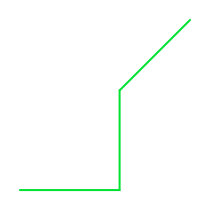
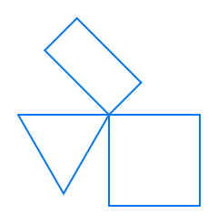
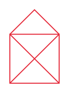

# Bewegung und Drehung

Du hast bereits dein erstes Programm geschrieben und die Schildkröte ein **L** und ein Quadrat zeichnen lassen. Dabei hast du die Befehle `forward()` und `right()` kennengelernt. In diesem Kapitel schauen wir uns alle wichtigen Bewegungsbefehle genauer an und lernen, wie die Schildkröte sich noch bewegen und drehen kann.

## Vorwärts und rückwärts gehen

Die Schildkröte kann sich vorwärts und rückwärts bewegen:

### Vorwärts gehen

```rust
turtle.forward(100.0);
```

Dieser Befehl bewegt die Schildkröte 100 Schritte vorwärts in die Richtung, in die sie gerade schaut.

### Rückwärts gehen

```rust
turtle.backward(50.0);
```

Dieser Befehl bewegt die Schildkröte 50 Schritte rückwärts, ohne dass sie sich umdreht.

### Beispiel: Vor und zurück

Hier ist ein Programm, das beides zeigt:

```rust
{{#include ../codesamples/examples/vorwaerts_rueckwaerts.rs}}
```


Die Schildkröte geht zuerst 100 Schritte vorwärts, dann 50 Schritte zurück. Die Linie wird rot sein.

## Nach links und rechts drehen

Die Schildkröte kann sich drehen, ohne sich zu bewegen:

### Nach links drehen

```rust
turtle.left(90.0);
```

Dreht die Schildkröte 90 Grad nach links (gegen den Uhrzeigersinn).

### Nach rechts drehen

```rust
turtle.right(90.0);
```

Dreht die Schildkröte 90 Grad nach rechts (im Uhrzeigersinn).

## Was sind Grade?

Grade sind ein Maß für Winkel. Ein voller Kreis hat 360 Grad:
- 90 Grad = ein rechter Winkel (ein Viertel eines Kreises)
- 180 Grad = ein halber Kreis (die Schildkröte schaut in die entgegengesetzte Richtung)
- 360 Grad = ein ganzer Kreis (zurück zur Ausgangsrichtung)

### Beispiel: Drehen und zeichnen

```rust
{{#include ../codesamples/examples/drehen.rs}}
```



In diesem Programm:
1. Die Schildkröte geht vorwärts und zeichnet eine grüne Linie
2. Sie dreht sich 90 Grad nach links
3. Sie zeichnet eine weitere Linie
4. Sie dreht sich 45 Grad nach rechts
5. Sie zeichnet eine dritte Linie

So entsteht eine interessante Form!

## Die Startposition der Schildkröte

Wenn ein Programm startet:
- Die Schildkröte ist in der Mitte des Bildschirms
- Sie schaut nach rechts (das ist 0 Grad)
- Der Stift ist unten (sie zeichnet also)

## Übungsaufgaben

Jetzt bist du dran! Hier sind einige Aufgaben, um das Gelernte zu üben.

### Aufgabe 1: Geometrische Übung

Zeichne ein gleichseitiges Dreieck mit der Schildkröte. Ein gleichseitiges Dreieck hat drei gleich lange Seiten und drei gleiche Winkel von je 60 Grad.

**Hinweis:** Du musst die Schildkröte bei jedem Eckpunkt drehen. Denk daran, dass du die Schildkröte um 120 Grad drehen musst (nicht 60 Grad!), weil die Schildkröte sich nach außen dreht.

So sollte dein Ergebnis aussehen:



<details>
<summary><b>Lösung anzeigen</b></summary>

```rust
{{#include ../codesamples/examples/geometrische_uebung.rs}}
```

</details>

### Aufgabe 2: Haus vom Nikolaus

Kennst du den Spruch "Das ist das Haus vom Nikolaus"? Dabei zeichnet man ein Haus in einem Zug, ohne den Stift abzusetzen. Versuche, diese klassische Zeichenübung nachzuprogrammieren!

**Hinweis:** Das Haus besteht aus einem Quadrat und einem Dreieck als Dach. Du musst verschiedene Winkel verwenden: 90 Grad für die Ecken des Quadrats und 45 Grad für die Diagonalen. Die Diagonale ist etwas länger als die Seiten (ungefähr 141 statt 100).

So sollte dein Ergebnis aussehen:



<details>
<summary><b>Lösung anzeigen</b></summary>

```rust
{{#include ../codesamples/examples/haus_vom_nikolaus.rs}}
```

**Erklärung der Lösung:**
1. Zuerst zeichnen wir das Quadrat im Uhrzeigersinn
2. Dann drehen wir uns um 45 Grad zur ersten Diagonale
3. Wir zeichnen die Diagonale von unten links nach oben rechts
4. Danach das Dach: erst zur Spitze, dann zurück
5. Zum Schluss die zweite Diagonale zurück zum Startpunkt

Die Diagonalen sind länger als die Seiten, weil sie schräg durch das Quadrat gehen. Für ein 100×100 Quadrat ist die Diagonale etwa 141 lang (das ist 100 multipliziert mit der Wurzel aus 2).

</details>

### Aufgabe 3: Fünfstern

Zeichne einen fünfzackigen Stern! Dies ist etwas anspruchsvoller, weil du einen besonderen Winkel verwenden musst.

**Hinweis:** Bei einem fünfzackigen Stern musst du bei jeder Zacke 144 Grad drehen (das ist 720 ÷ 5). Wiederhole die Bewegung `forward()` und `right(144.0)` fünf Mal. Da du noch keine Schleifen kennst, musst du den Code fünf Mal schreiben – im nächsten Kapitel lernst du, wie du das eleganter lösen kannst!

So sollte dein Ergebnis aussehen:


<details>
<summary><b>Lösung anzeigen</b></summary>

```rust
{{#include ../codesamples/examples/fuenfstern.rs}}
```

**Warum 144 Grad?** Ein Stern ist anders als ein regelmäßiges Fünfeck. Die Schildkröte muss sich bei einem Stern stärker drehen, weil sie nicht zur nächsten Ecke geht, sondern eine Ecke überspringt. Um einen fünfzackigen Stern zu zeichnen, muss die Schildkröte insgesamt zwei volle Umdrehungen (720 Grad) machen. Pro Zacke ist das: 720 ÷ 5 = 144 Grad. (Bei einem normalen Fünfeck wären es nur 360 ÷ 5 = 72 Grad.)

</details>

## Zusammenfassung

Du hast gelernt:
- `forward(schritte)` - bewegt die Schildkröte vorwärts
- `backward(schritte)` - bewegt die Schildkröte rückwärts
- `left(grad)` - dreht die Schildkröte nach links
- `right(grad)` - dreht die Schildkröte nach rechts
- Grade messen Winkel (90° = rechter Winkel, 360° = voller Kreis)

Im nächsten Kapitel lernst du, wie du Befehle wiederholen kannst, um interessante Formen zu zeichnen.
