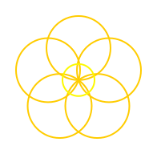

# Kreise und gekrümmte Linien

Du hast gelernt, wie du gerade Linien und Winkel verwendest, um verschiedene Formen zu zeichnen. Aber nicht alle Formen bestehen aus geraden Linien! In diesem Kapitel lernst du, wie du **Kreise und gekrümmte Linien** mit der Schildkröte zeichnest – viel einfacher, als viele kleine gerade Linien zu kombinieren!

## Was ist eine gekrümmte Linie?

Eine **gekrümmte Linie** (oder ein Kreisbogen) ist ein Teil eines Kreises. Die Schildkröte zeichnet sanfte Kurven statt nur gerader Linien.

## circle_left() – Nach links drehen und zeichnen

Mit `circle_left()` zeichnest du einen Kreisbogen, bei dem die Schildkröte nach links (gegen den Uhrzeigersinn) dreht:

```rust
turtle.circle_left(radius, angle, steps);
```

- `radius`: Der Abstand vom Mittelpunkt des Kreises zur Schildkröte (in Pixeln)
- `angle`: Der Winkel des Bogens in Grad (360° = ein ganzer Kreis)
- `steps`: Die Anzahl der Liniensegmente (je größer, desto glatter)

### Beispiel: Ein Halbkreis nach links

```rust
{{#include ../codesamples/examples/halbkreis_links.rs}}
```


## circle_right() – Nach rechts drehen und zeichnen

Mit `circle_right()` zeichnest du einen Kreisbogen, bei dem die Schildkröte nach rechts (im Uhrzeigersinn) dreht:

```rust
turtle.circle_right(radius, angle, steps);
```

Die Parameter sind gleich wie bei `circle_left()`, aber die Kurve dreht sich in die andere Richtung.

### Beispiel: Ein Halbkreis nach rechts

```rust
{{#include ../codesamples/examples/halbkreis_rechts.rs}}
```


## Volle Kreise zeichnen

Um einen vollen Kreis zu zeichnen, verwendest du einen Winkel von 360°:

```rust
turtle.circle_left(50.0, 360.0, 36);
```

Das zeichnet einen perfekten Kreis mit einem Radius von 50 Pixeln!

## Kombinieren von Kurven

Du kannst mehrere `circle_left()` und `circle_right()` Befehle hintereinander verwenden, um komplexere Formen zu erstellen. Zum Beispiel:

```rust
turtle.circle_left(50.0, 180.0, 36);   // Halbkreis nach links
turtle.circle_right(50.0, 180.0, 36);  // Halbkreis nach rechts
```

Das zeichnet eine S-förmige Kurve!

## Übungsaufgaben

Jetzt bist du dran! Hier sind einige Aufgaben, um das Gelernte zu üben.

### Aufgabe 1: Ein Herz

Zeichne ein Herz! Ein Herz besteht aus zwei Halbkreisen oben und einer Spitze unten.

**Hinweis:** Beginne unten bei der Spitze.Du kannst das Herz mit `circle_right()` für die beiden oberen Rundungen zeichnen.

So sollte dein Ergebnis aussehen:


### Aufgabe 2: Ein Stern mit abgerundeten Spitzen

Zeichne einen Stern wie in Kapitel 4, aber mit abgerundeten Spitzen statt scharfen Ecken!

**Hinweis:** Statt `forward()` und `right()` direkt zu verwenden, nutze `circle_right()` für die Spitzen des Sterns. Das gibt ihnen eine schöne, gerundete Form. Du brauchst 5 Schleifen für die 5 Spitzen des Sterns.

So sollte dein Ergebnis aussehen:


### Aufgabe 3: Yin und Yang

Zeichne das klassische Yin-Yang Symbol mit zwei ineinanderliegenden Kurven!

**Hinweis:** Das Yin-Yang Symbol besteht aus einer großen Kurve, die den Kreis halbiert, und einer kleineren Kurve, die die andere Hälfte füllt. Verwende `circle_right()` und `circle_left()` in Kombination. Du kannst auch verschiedene Radien und Füllfarben verwenden.

So sollte dein Ergebnis aussehen:


### Aufgabe 4: Eine Blume

Zeichne eine Blume mit Blütenblättern! Jedes Blütenblatt ist eine gekrümmte Form.

**Hinweis:** Eine Blume besteht aus mehreren Blütenblättern, die in einem Kreis angeordnet sind. Du kannst jedes Blütenblatt mit `circle_left()` und `circle_right()` zeichnen und dann die Schildkröte drehen, um das nächste Blütenblatt zu zeichnen. Eine Schleife hilft dir dabei!

So sollte dein Ergebnis aussehen:



## Zusammenfassung

Du hast gelernt:
- `circle_left(radius, angle, steps)` - Zeichnet einen Kreisbogen nach links
- `circle_right(radius, angle, steps)` - Zeichnet einen Kreisbogen nach rechts
- Mit `angle = 360.0` zeichnest du einen vollen Kreis
- Mit Kurven kannst du viel interessantere und realistischere Formen zeichnen

Im nächsten Kapitel lernst du, wie du mit Farben arbeitest und den Stift heben und senken kannst.