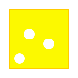
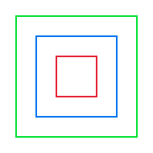

# Farben und Stift

Du hast gelernt, wie du gerade Linien oder gekrümmte Kurven zeichnest. Jetzt machen wir unsere Zeichnungen bunter! Viele der Beispiele haben schon farben verwendet. In diesem Kapitel lernst du, wie du die Farbe änderst und den Stift hebst und senkst und wie du Flächen füllst.

## Die Stiftfarbe ändern

Du kannst die Farbe des Stifts jederzeit ändern:

```rust
turtle.set_pen_color(RED);    // Rot
turtle.set_pen_color(BLUE);   // Blau
turtle.set_pen_color(GREEN);  // Grün
turtle.set_pen_color(YELLOW); // Gelb
```

### Verfügbare Farben

Die Turtle-Bibliothek bietet viele vordefinierte Farben:
- `RED` (Rot)
- `BLUE` (Blau)
- `GREEN` (Grün)
- `YELLOW` (Gelb)
- `ORANGE` (Orange)
- `PURPLE` (Lila)
- `PINK` (Rosa)
- `BLACK` (Schwarz)
- `WHITE` (Weiß)
- `GOLD` (Gold)

Wenn du mehr Farben möchtest, kannst du mit `use macroquad::color::colors::*;` noch mehr Farben verwenden, z.B. `DARKGREEN`, `CYAN`, `MAGENTA` und viele mehr! Eine Liste der Farben bekommt man, wenn man nach dem einbinden von `macroquad::color::colors` die Autovervollständigung des Editors benutzt, also `colors::` eingibt und dann die Vorschläge anschaut.

## Beispiel: Bunte Linien

```rust
{{#include ../codesamples/examples/farben.rs}}
```


Dieses Programm zeichnet ein buntes Quadrat, bei dem jede Seite eine andere Farbe hat!

## Den Stift heben und senken

Manchmal möchtest du die Schildkröte bewegen, ohne eine Linie zu zeichnen. Dafür kannst du den Stift heben:

### Stift heben

```rust
turtle.pen_up();
```

Nach diesem Befehl zeichnet die Schildkröte keine Linie mehr, wenn sie sich bewegt.

### Stift senken

```rust
turtle.pen_down();
```

Nach diesem Befehl zeichnet die Schildkröte wieder Linien.

### Beispiel: Unterbrochene Linie

```rust
{{#include ../codesamples/examples/stift_heben.rs}}
```


Dieses Programm zeichnet eine Linie, hebt dann den Stift, bewegt sich ohne zu zeichnen, und zeichnet dann wieder eine Linie. Es entsteht eine unterbrochene Linie!

## Flächen ausfüllen

Du kannst auch Formen mit Farbe ausfüllen:

```rust
{{#include ../codesamples/examples/fuellen.rs}}
```


### Wie funktioniert das Füllen?

1. `set_fill_color(BLUE)` - Setzt die Füllfarbe auf Blau
2. `begin_fill()` - Beginnt mit dem Füllen (merkt sich den Startpunkt)
3. Zeichne die Form (hier ein Dreieck)
4. `end_fill()` - Beendet das Füllen und füllt die Form aus

Die Form wird automatisch zwischen dem Start- und Endpunkt geschlossen und ausgefüllt.

## Die Stiftdicke ändern

Du kannst auch die Dicke des Stifts ändern:

```rust
turtle.set_pen_width(5.0);  // Dicker Stift
turtle.set_pen_width(1.0);  // Dünner Stift
```

Je größer die Zahl, desto dicker die Linie!

## Übungsaufgaben

Jetzt bist du dran! Hier sind einige Aufgaben, um das Gelernte zu üben.

### Aufgabe 1: Ein ausgefüllter Stern

Zeichne einen fünfzackigen Stern und fülle ihn mit einer Farbe aus!

**Hinweis:** Verwende `begin_fill()` vor dem Zeichnen des Sterns und `end_fill()` danach. Du kannst die Füllfarbe mit `set_fill_color()` setzen und die Randfarbe mit `set_pen_color()` wählen. Für den Stern brauchst du eine Schleife mit 5 Wiederholungen und einem Drehwinkel von 144 Grad.

So sollte dein Ergebnis aussehen:


### Aufgabe 2: Ein Käse

Zeichne ein gelbes Käsestück! Ein Käsestück ist ein Viereck mit drei runden Löchern darin.

**Hinweis:** Zeichne zuerst ein ausgefülltes gelbes Viereck. Dann hebe den Stift (`pen_up()`), bewege die Schildkröte zu verschiedenen Positionen mit `goto(x, y)`, senke den Stift wieder (`pen_down()`) und zeichne drei kleine ausgefüllte weiße Kreise (du kannst einen Kreis zeichnen, indem du ein Vieleck mit vielen Seiten und kleinen Winkeln zeichnest, z.B. 36 Seiten mit je 10 Grad Drehung).

So sollte dein Ergebnis aussehen:



### Aufgabe 3: Drei ineinanderliegende Quadrate

So sollte dein Ergebnis aussehen:



Zeichne drei Quadrate, die ineinander liegen, aber sich nicht berühren!

**Hinweis:** Zeichne zuerst ein kleines Quadrat in der Mitte. Dann hebe den Stift (`pen_up()`), bewege die Schildkröte etwas nach links und unten, senke den Stift (`pen_down()`) und zeichne ein größeres Quadrat. Wiederhole das für ein drittes, noch größeres Quadrat. Du kannst auch verschiedene Farben für jedes Quadrat verwenden!

## Zusammenfassung

Du hast gelernt:
- `set_pen_color(farbe)` - Ändert die Stiftfarbe
- `pen_up()` - Hebt den Stift (zeichnet nicht mehr)
- `pen_down()` - Senkt den Stift (zeichnet wieder)
- `set_fill_color(farbe)` - Setzt die Füllfarbe
- `begin_fill()` - Beginnt mit dem Füllen einer Form
- `end_fill()` - Beendet das Füllen und füllt die Form aus
- `set_pen_width(dicke)` - Ändert die Stiftdicke

Im nächsten Kapitel lernst du, wie du **Schleifen** verwendest, um deine Zeichnungen noch effizienter zu machen!
