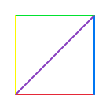
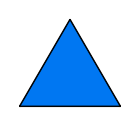

# Farben und Stift

Du hast gelernt, wie Schleifen dir helfen, Code zu wiederholen und komplexe Formen mit wenig Code zu zeichnen. Jetzt machen wir unsere Zeichnungen bunter! In diesem Kapitel lernst du, wie du die Farbe änderst und den Stift hebst und senkst.

## Die Stiftfarbe ändern

Du kannst die Farbe des Stifts jederzeit ändern:

```rust
turtle.set_pen_color(RED);    // Rot
turtle.set_pen_color(BLUE);   // Blau
turtle.set_pen_color(GREEN);  // Grün
turtle.set_pen_color(YELLOW); // Gelb
```

### Verfügbare Farben

Die Turtle-Bibliothek bietet viele vordefinierte Farben:
- `RED` (Rot)
- `BLUE` (Blau)
- `GREEN` (Grün)
- `YELLOW` (Gelb)
- `ORANGE` (Orange)
- `PURPLE` (Lila)
- `PINK` (Rosa)
- `BLACK` (Schwarz)
- `WHITE` (Weiß)
- `GOLD` (Gold)
- und viele mehr!

## Beispiel: Bunte Linien

```rust
{{#include ../codesamples/examples/farben.rs}}
```



Dieses Programm zeichnet ein buntes Quadrat, bei dem jede Seite eine andere Farbe hat!

## Den Stift heben und senken

Manchmal möchtest du die Schildkröte bewegen, ohne eine Linie zu zeichnen. Dafür kannst du den Stift heben:

### Stift heben

```rust
turtle.pen_up();
```

Nach diesem Befehl zeichnet die Schildkröte keine Linie mehr, wenn sie sich bewegt.

### Stift senken

```rust
turtle.pen_down();
```

Nach diesem Befehl zeichnet die Schildkröte wieder Linien.

### Beispiel: Unterbrochene Linie

```rust
{{#include ../codesamples/examples/stift_heben.rs}}
```


Dieses Programm zeichnet eine Linie, hebt dann den Stift, bewegt sich ohne zu zeichnen, und zeichnet dann wieder eine Linie. Es entsteht eine unterbrochene Linie!

## Flächen ausfüllen

Du kannst auch Formen mit Farbe ausfüllen:

```rust
{{#include ../codesamples/examples/fuellen.rs}}
```



### Wie funktioniert das Füllen?

1. `set_fill_color(BLUE)` - Setzt die Füllfarbe auf Blau
2. `begin_fill()` - Beginnt mit dem Füllen (merkt sich den Startpunkt)
3. Zeichne die Form (hier ein Dreieck)
4. `end_fill()` - Beendet das Füllen und füllt die Form aus

Die Form wird automatisch zwischen dem Start- und Endpunkt geschlossen und ausgefüllt.

## Die Stiftdicke ändern

Du kannst auch die Dicke des Stifts ändern:

```rust
turtle.set_pen_width(5.0);  // Dicker Stift
turtle.set_pen_width(1.0);  // Dünner Stift
```

Je größer die Zahl, desto dicker die Linie!

## Kreative Möglichkeiten

Mit diesen Befehlen kannst du jetzt:
- Bunte Muster zeichnen
- Formen mit verschiedenen Farben füllen
- Die Schildkröte bewegen, ohne eine Spur zu hinterlassen
- Dicke und dünne Linien kombinieren

## Zusammenfassung

Du hast gelernt:
- `set_pen_color(farbe)` - Ändert die Stiftfarbe
- `pen_up()` - Hebt den Stift (zeichnet nicht mehr)
- `pen_down()` - Senkt den Stift (zeichnet wieder)
- `set_fill_color(farbe)` - Setzt die Füllfarbe
- `begin_fill()` - Beginnt mit dem Füllen einer Form
- `end_fill()` - Beendet das Füllen und füllt die Form aus
- `set_pen_width(dicke)` - Ändert die Stiftdicke

Im nächsten Kapitel lernst du, wie du Werte speichern und wiederverwenden kannst – mit Variablen!
