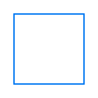
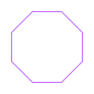

# Wiederholungen (Schleifen)

Du kennst jetzt gerade Linien und auch gekrümmte Linien mit Kreisen. Egal ob gerade oder gekrümmt – wenn du die gleiche Bewegung mehrmals hintereinander brauchst, möchtest du das nicht jedes Mal von Hand aufschreiben. In diesem Kapitel lernst du **Schleifen** – damit kannst du Befehle automatisch wiederholen!

```rust
turtle.forward(100.0);
turtle.right(90.0);

turtle.forward(100.0);
turtle.right(90.0);

turtle.forward(100.0);
turtle.right(90.0);

turtle.forward(100.0);
turtle.right(90.0);
```

Das war ziemlich mühsam! Stell dir vor, du möchtest 100 mal den gleichen Befehl ausführen. Es wäre sehr mühsam, diesen Befehl 100 mal zu schreiben! Hier kommen **Schleifen** ins Spiel.

## Was ist eine Schleife?

Eine **Schleife** ist ein Programmierkonstrukt, das Befehle mehrmals wiederholt. Du sagst dem Computer: "Führe diese Befehle X-mal aus."

## Die for-Schleife

Die häufigste Art von Schleife ist die `for`-Schleife. Hier ist die Grundstruktur:

```rust
for _ in 0..anzahl {
    // Befehle, die wiederholt werden
}
```

- `for` bedeutet "für jede Wiederholung"
- `0..anzahl` gibt an, wie oft wiederholt wird (von 0 bis anzahl-1)
- Der Unterstrich `_` bedeutet, dass wir die Zählvariable nicht brauchen
- Die Befehle **innerhalb** der geschweiften Klammern `{ }` werden wiederholt

## Aufgabe 1: Ein Quadrat mit Schleife

Erinnere dich an unser Quadrat von vorhin. Versuche jetzt, ein Quadrat mit einer Schleife zu zeichnen. Das wird viel kürzer und übersichtlicher als den Code viermal zu schreiben!

**Hinweis:** Ein Quadrat hat 4 Seiten. Die Formel 360 ÷ 4 = 90 Grad zeigt dir den Drehwinkel.

So sollte dein Ergebnis aussehen:



### Lösungsblock

<details>
<summary>Zeige die Lösung</summary>

```rust
{{#include ../codesamples/examples/quadrat_schleife.rs}}
```

Statt 8 Zeilen Code haben wir jetzt nur noch 3 Zeilen in der Schleife. Das macht genau das Gleiche wie der lange Code vorher, ist aber viel einfacher zu lesen und zu verstehen!

</details>

## Aufgabe 2: Ein Achteck

Ein Achteck hat 8 gleich lange Seiten. Versuche, es mit einer Schleife zu zeichnen.

**Hinweis:** Verwende die Formel 360 ÷ 8 = 45 Grad für den Drehwinkel. Du brauchst eine Schleife mit 8 Wiederholungen.

So sollte dein Ergebnis aussehen:



## Die Formel für regelmäßige Vielecke

Für ein Vieleck mit `n` Seiten ist der Drehwinkel:

**360 ÷ n**

Beispiele:
- Dreieck (3 Seiten): 360 ÷ 3 = 120 Grad
- Quadrat (4 Seiten): 360 ÷ 4 = 90 Grad
- Fünfeck (5 Seiten): 360 ÷ 5 = 72 Grad
- Sechseck (6 Seiten): 360 ÷ 6 = 60 Grad
- Achteck (8 Seiten): 360 ÷ 8 = 45 Grad

## Aufgabe 3: Ein Stern

Wollen wir etwas Komplexeres zeichnen? Versuche, einen fünfzackigen Stern zu zeichnen!

**Hinweis:** Ein fünfzackiger Stern braucht einen anderen Winkel als ein regelmäßiges Fünfeck. Hier verwendest du 144 Grad (das ist 720 ÷ 5). Du brauchst eine Schleife mit 5 Wiederholungen.

So sollte dein Ergebnis aussehen:


## Warum sind Schleifen nützlich?

Schleifen sind sehr nützlich, weil:
1. **Weniger Code**: Statt 8 mal den gleichen Befehl zu schreiben, schreibst du ihn nur einmal
2. **Weniger Fehler**: Du kannst dich nicht vertippen, wenn du nur einmal schreibst
3. **Leichter zu ändern**: Willst du ein Zehneck statt eines Achtecks? Ändere einfach die `8` zu `10`!

## Weitere Aufgaben zum Üben

Versuche, diese Formen zu zeichnen:
- Ein Dreieck (3 Seiten, 120 Grad)
- Ein Sechseck (6 Seiten, 60 Grad)
- Ein Zwölfeck (12 Seiten, 30 Grad)

## Zusammenfassung

Du hast gelernt:
- Was eine Schleife ist (ein Befehl, der sich wiederholt)
- Wie man eine `for`-Schleife schreibt
- Die Formel für regelmäßige Vielecke: 360 ÷ anzahl_seiten
- Dass Schleifen den Code kürzer und einfacher machen

Im nächsten Kapitel lernst du, wie du Werte speichern und wiederverwenden kannst – mit Variablen!
