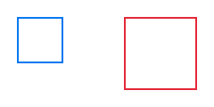
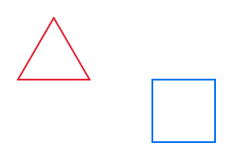

# Funktionen

Mit Variablen kannst du Werte speichern und wiederverwenden – das hast du im letzten Kapitel gelernt. Aber was, wenn du nicht nur Werte, sondern ganze Code-Abschnitte wiederverwenden möchtest? Hier kommen **Funktionen** ins Spiel. Funktionen sind wie kleine Unterprogramme, die eine bestimmte Aufgabe erledigen. Sie helfen dir, deinen Code zu organisieren und wiederzuverwenden.

## Was ist eine Funktion?

Eine **Funktion** ist ein benannter Block von Code, den du immer wieder aufrufen kannst. Stell dir vor, du hast ein Rezept für Pfannkuchen. Anstatt jedes Mal die ganze Anleitung aufzuschreiben, sagst du einfach "Mache Pfannkuchen" – und alle wissen, was zu tun ist.

## Die main-Funktion

Du kennst bereits eine Funktion – die `main`-Funktion! Das ist die Funktion, in der dein Programm startet:

```rust
fn main() {
    // Dein Code hier
}
```

## Eine eigene Funktion erstellen

So erstellst du eine eigene Funktion:

```rust
fn zeichne_quadrat(turtle: &mut TurtlePlan, groesse: f32) {
    for _ in 0..4 {
        turtle.forward(groesse);
        turtle.right(90.0);
    }
}
```

Was bedeutet das?
- `fn` bedeutet "function" (Funktion)
- `zeichne_quadrat` ist der Name der Funktion
- `(turtle: &mut TurtlePlan, groesse: f32)` sind die **Parameter** (Werte, die die Funktion braucht)
- Der Code zwischen `{ }` wird ausgeführt, wenn die Funktion aufgerufen wird

## Parameter

**Parameter** sind Werte, die du einer Funktion übergibst. In unserem Beispiel:
- `turtle: &mut TurtlePlan` - Die Schildkröte, die zeichnen soll
- `groesse: f32` - Die Größe des Quadrats

So kann die gleiche Funktion Quadrate in verschiedenen Größen zeichnen!

## Eine Funktion aufrufen

Um eine Funktion zu verwenden, rufst du sie auf:

```rust
zeichne_quadrat(&mut turtle, 50.0);
```

Das bedeutet: "Führe die Funktion `zeichne_quadrat` aus und übergib ihr die Schildkröte und die Größe 50.0."

## Vollständiges Beispiel

```rust
{{#include ../codesamples/examples/funktionen.rs}}
```



Dieses Programm:
1. Definiert eine Funktion `zeichne_quadrat`
2. Zeichnet ein kleines Quadrat (50.0)
3. Bewegt die Schildkröte
4. Zeichnet ein größeres Quadrat (80.0) in einer anderen Farbe

Die Funktion können wir so oft aufrufen, wie wir wollen – mit verschiedenen Größen!

## Mehrere Funktionen

Du kannst so viele Funktionen erstellen, wie du möchtest:

```rust
{{#include ../codesamples/examples/mehrere_formen.rs}}
```



Hier haben wir zwei Funktionen:
- `zeichne_dreieck` - zeichnet ein Dreieck
- `zeichne_quadrat` - zeichnet ein Quadrat

Jede Funktion macht genau eine Sache – das macht den Code übersichtlich!

## Warum Funktionen verwenden?

Funktionen haben viele Vorteile:

1. **Wiederverwendung**: Schreibe den Code einmal, verwende ihn oft
2. **Organisation**: Teile komplexe Programme in kleine, verständliche Teile
3. **Lesbarkeit**: `zeichne_stern()` ist leichter zu verstehen als 20 Zeilen Code
4. **Fehlersuche**: Wenn etwas nicht funktioniert, weißt du genau, wo du suchen musst

## Funktionen ohne Parameter

Funktionen müssen nicht unbedingt Parameter haben:

```rust
fn zeichne_stern(turtle: &mut TurtlePlan) {
    for _ in 0..5 {
        turtle.forward(100.0);
        turtle.right(144.0);
    }
}
```

Diese Funktion zeichnet immer einen Stern mit der gleichen Größe.

## Das DRY-Prinzip

Programmierer folgen oft dem **DRY-Prinzip**: "Don't Repeat Yourself" (Wiederhole dich nicht).

**Schlecht** (sich wiederholend):
```rust
// Quadrat 1
for _ in 0..4 {
    turtle.forward(50.0);
    turtle.right(90.0);
}
// ... Position ändern ...
// Quadrat 2
for _ in 0..4 {
    turtle.forward(80.0);
    turtle.right(90.0);
}
```

**Gut** (mit Funktion):
```rust
zeichne_quadrat(&mut turtle, 50.0);
// ... Position ändern ...
zeichne_quadrat(&mut turtle, 80.0);
```

Die Version mit Funktion ist kürzer, klarer und leichter zu ändern!

## Übungsaufgaben

Jetzt bist du dran! Hier sind Aufgaben zum Üben von Funktionen. Denke daran: Mit Funktionen kannst du denselben Code immer wieder aufrufen – und mit Parametern kannst du ihn flexibel gestalten!

### Aufgabe 1: Dreieck-Funktion

Erstelle eine Funktion `zeichne_dreieck()`, die ein gleichseitiges Dreieck zeichnet. Die Funktion soll einen Parameter `groesse` haben, damit du Dreiecke verschiedener Größen zeichnen kannst.

### Aufgabe 2: Viereck und Fünfeck

Schreibe zwei Funktionen:
- `zeichne_viereck(turtle: &mut TurtlePlan, groesse: f32)` für ein Quadrat
- `zeichne_fuenfeck(turtle: &mut TurtlePlan, groesse: f32)` für ein regelmäßiges Fünfeck

### Aufgabe 3: Fünfstern-Funktion

Erstelle eine Funktion `zeichne_fuenfstern()`, die einen fünfzackigen Stern zeichnet. Der Stern soll einen Parameter `groesse` haben.

### Aufgabe 4: Herz-Funktion

Schreibe eine Funktion `zeichne_herz()`, die ein Herz zeichnet. Das ist anspruchsvoll – überlege, wie du Kurven mit geraden Linien und Drehungen näherungsweise zeichnen kannst!

### Aufgabe 5: Blume-Funktion

Erstelle eine Funktion `zeichne_blume(turtle: &mut TurtlePlan, blaetter: i32)`, die eine Blume mit mehreren Blütenblättern zeichnet. Die Funktion soll bestimmen können, wie viele Blütenblätter die Blume hat.

**Tipp:** Zeichne ein Blütenblatt (Kreis), drehe die Schildkröte dann um einen Winkel und wiederhole das. Bei `blaetter` Blättern drehst du jeweils um `360 / blaetter` Grad.

### Aufgabe 6: Haus mit Funktionen

Schreibe eine Funktion `zeichne_haus(turtle: &mut TurtlePlan, breite: f32)`, die ein komplettes Haus zeichnet (ein Quadrat mit einem dreieckigen Dach). Die Größe soll über den Parameter `breite` bestimmt werden.

Rufe die Funktion mehrmals auf, um ein ganzes Dorf mit unterschiedlich großen Häusern zu zeichnen! Bewege die Schildkröte zwischen den Häusern mit `forward()` und `backward()`, damit die Häuser nebeneinander stehen.

## Zusammenfassung

Du hast gelernt:
- `fn name() { }` - Erstellt eine neue Funktion
- Parameter ermöglichen es, Werte an Funktionen zu übergeben
- Funktionen machen Code wiederverwendbar und übersichtlich
- Das DRY-Prinzip: "Don't Repeat Yourself"
- Jede Funktion sollte eine klare Aufgabe haben

Im nächsten Kapitel siehst du weitere kreative Beispiele, die alles zusammenbringen, was du gelernt hast!
