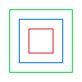
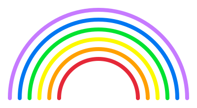

# Weitere Beispiele

Du hast in den letzten Kapiteln viel gelernt: Bewegung, Schleifen, Farben, Variablen und Funktionen. Jetzt ist es Zeit, alles zusammenzubringen! In diesem Kapitel schauen wir uns einige kreative Beispiele an, die zeigen, was du mit der Turtle-Grafik alles machen kannst.

## Ideen zum Experimentieren

Jetzt bist du dran! Hier sind einige Ideen, was du ausprobieren kannst:

### 1. Muster mit verschiedenen Farben

Versuche, ein Programm zu schreiben, das mehrere Quadrate in verschiedenen Farben zeichnet, die sich überlappen.

**Tipp:** Verwende `pen_up()` und `pen_down()`, um die Schildkröte zwischen den Quadraten zu bewegen.

### 2. Ein Haus zeichnen

Zeichne ein einfaches Haus:
- Ein Quadrat für das Gebäude
- Ein Dreieck für das Dach
- Ein kleines Rechteck für die Tür
- Zwei kleine Quadrate für die Fenster

**Tipp:** Erstelle Funktionen für `zeichne_rechteck()` und `zeichne_dreieck()`.

### 3. Eine Blume

Zeichne eine Blume mit mehreren Blütenblättern:
- Jedes Blütenblatt ist ein ausgefüllter Kreis oder eine Ellipse
- Drehe die Schildkröte nach jedem Blütenblatt
- Verwende verschiedene Farben

### 4. Ein Regenbogen

Zeichne konzentrische Halbkreise in verschiedenen Farben:
- Rot (außen)
- Orange
- Gelb
- Grün
- Blau
- Lila (innen)

**Tipp:** Du kannst `circle_left()` oder `circle_right()` für Kreisbögen verwenden.

### 5. Dein Name

Versuche, die Buchstaben deines Namens mit der Schildkröte zu zeichnen! Du kannst mit einem großen Anfangsbuchstaben starten und dann immer weiter einzelne Buchstaben zu einem Wort kombinieren.

## Tipps für kreative Zeichnungen

1. **Plane vorher**: Überlege dir, welche Formen du brauchst
2. **Funktionen**: Erstelle Funktionen für wiederholte Formen
3. **Farben**: Experimentiere mit verschiedenen Farben
4. **Füllung**: Verwende `begin_fill()` und `end_fill()` für ausgefüllte Formen
5. **Position**: Nutze `pen_up()` und `pen_down()`, um die Schildkröte zu bewegen

## Was du bis jetzt gelernt hast

Herzlichen Glückwunsch! Du hast die Grundlagen des Programmierens gelernt:

### Konzepte
- **Sequenz**: Befehle werden nacheinander ausgeführt
- **Wiederholung**: Schleifen wiederholen Befehle
- **Variablen**: Werte speichern und wiederverwenden
- **Funktionen**: Code organisieren und wiederverwenden

### Turtle-Befehle
- Bewegung: `forward()`, `backward()`
- Drehung: `left()`, `right()`
- Farben: `set_pen_color()`, `set_fill_color()`
- Stift: `pen_up()`, `pen_down()`
- Füllung: `begin_fill()`, `end_fill()`
- Dicke: `set_pen_width()`

### Rust-Grundlagen
- `let` für Variablen
- `for` für Schleifen
- `fn` für Funktionen
- Kommentare mit `//`

## Wie geht es weiter?

Du hast jetzt eine solide Grundlage für das Programmieren! Mit Bewegung, Schleifen, Farben, Variablen und Funktionen kannst du schon viele tolle Zeichnungen erstellen.

Aber Rust kann noch viel mehr! In den nächsten Kapiteln lernst du:
- **Strings**: Wie man mit Text arbeitet
- **Sammlungen**: Listen von Werten verwalten
- **Structs**: Eigene Datentypen erstellen
- **Enums**: Verschiedene Zustände modellieren

Diese Konzepte sind wichtig, um richtige Programme zu schreiben – zum Beispiel ein Hangman-Spiel!

## Wichtige Tipps für Anfänger

1. **Fehler sind normal**: Jeder Programmierer macht Fehler – auch erfahrene!
2. **Ausprobieren**: Experimentiere mit dem Code und schau, was passiert
3. **Kleine Schritte**: Ändere immer nur eine Sache und teste dann
4. **Fragen stellen**: Wenn du nicht weiterkommst, frage jemanden oder suche online

## Zusammenfassung

Programmieren ist wie eine neue Sprache lernen – am Anfang ist es ungewohnt, aber mit der Zeit wird es immer leichter. Die Schildkröten-Grafik ist ein großartiger Einstieg, weil du sofort siehst, was dein Code bewirkt.🐢
